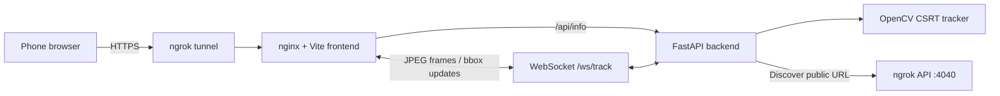

# Web Tracking

Real-time browser object tracking with a phone camera, OpenCV CSRT, FastAPI,
WebSockets, and a TypeScript canvas overlay.


Open the app on a phone, allow camera access, and drag a rectangle around an
object. The browser streams JPEG frames over a WebSocket, the backend tracks
the selected object, and the frontend draws the returned bounding box over the
live video.

## Features

- Mobile camera access through `getUserMedia()`
- Touch and mouse rectangle selection
- OpenCV CSRT object tracking
- Real-time bounding boxes over WebSocket
- `idle`, `tracking`, and `lost` tracker states
- Automatic ngrok URL discovery
- Responsive browser interface
- Fully Dockerized frontend, backend, and tunnel

## Architecture



The frontend and backend communicate over the private Docker network. nginx
serves the static application and proxies `/api/*` and `/ws/*` to FastAPI.
ngrok exposes nginx so camera access works from a phone over HTTPS.

## Stack

| Layer | Technology |
| --- | --- |
| Frontend | Vite, TypeScript, HTML5 video, Canvas |
| Backend | Python 3.11, FastAPI, Uvicorn |
| Tracking | OpenCV contrib, NumPy, CSRT |
| Transport | WebSocket with binary JPEG frames |
| Infrastructure | Docker Compose, nginx, ngrok |

## Quick Start

### 1. Configure ngrok

Create a free ngrok account, copy its auth token, and create your local env
file:

```bash
cp .env.example .env
```

Set the token in `.env`:

```env
NGROK_AUTHTOKEN=your_ngrok_auth_token
```

The free ngrok plan is sufficient. A random `https://*.ngrok-free.app` address
will be assigned when the container starts.

### 2. Start the project

```bash
docker compose up -d --build
```

### 3. Open the application

| Service | URL |
| --- | --- |
| Web application | http://localhost:3000 |
| Backend API | http://localhost:8000 |
| Backend health | http://localhost:8000/health |
| ngrok agent UI | http://localhost:4040 |

The public URL is shown on the application page and in the ngrok agent UI.
Open that HTTPS URL on your phone, press **Open Camera**, and drag over the
object you want to track.

## Local Mode

The application can run without ngrok:

```bash
docker compose up -d --build frontend backend
```

Camera access works on `localhost` in desktop browsers. A phone normally needs
the ngrok HTTPS URL because browsers restrict camera access on insecure origins.

## How It Works

1. The browser requests the rear camera when possible.
2. A hidden canvas encodes a JPEG frame approximately five times per second.
3. Binary JPEG data is sent to `/ws/track`.
4. The user selection is sent as a JSON `select` command.
5. FastAPI creates an independent CSRT tracker for that WebSocket connection.
6. OpenCV updates the tracker for every new frame.
7. The returned bounding box is drawn on the visible canvas overlay.

## WebSocket Protocol

Connect to:

```text
ws://localhost:3000/ws/track
```

Use `wss://` through the public ngrok URL.

Before selecting an object, send at least one JPEG frame as a binary WebSocket
message. Then send:

```json
{
  "type": "select",
  "bbox": {
    "x": 10,
    "y": 20,
    "w": 100,
    "h": 50
  }
}
```

Successful tracking update:

```json
{
  "type": "bbox",
  "bbox": {
    "x": 12,
    "y": 21,
    "w": 100,
    "h": 50
  },
  "ok": true
}
```

Lost object:

```json
{
  "type": "lost",
  "ok": false
}
```

## HTTP API

### `GET /`

Returns the backend name and status.

### `GET /health`

Docker healthcheck endpoint.

### `GET /api/info`

Returns locally configured and discovered connection URLs:

```json
{
  "local_url": "http://localhost:8000",
  "public_url": "https://example.ngrok-free.app",
  "websocket_url": "wss://example.ngrok-free.app/ws/track"
}
```

Until ngrok connects, `public_url` and `websocket_url` are `null`. The backend
polls `http://ngrok:4040/api/tunnels` and keeps the discovered URL in memory.

## Useful Commands

```bash
# Show container status
docker compose ps

# Follow all logs
docker compose logs -f

# Rebuild after code changes
docker compose up -d --build

# Stop the project
docker compose down
```

## Project Structure

```text
.
├── backend/
│   ├── app/
│   │   ├── main.py          # FastAPI, ngrok discovery, WebSocket endpoint
│   │   └── tracking.py      # JPEG decoding and CSRT lifecycle
│   └── requirements.txt
├── frontend/
│   ├── src/
│   │   ├── main.ts          # Camera and WebSocket pipelines
│   │   └── style.css
│   ├── nginx.conf           # Static files and backend proxy
│   └── package.json
├── Dockerfile               # Frontend and backend build targets
├── docker-compose.yml
└── .env.example
```

## Troubleshooting

### Port is already allocated

Another service is using port `3000`, `8000`, or `4040`. Stop that service or
change only the host side of the relevant Compose mapping, for example:

```yaml
ports:
  - "8001:8000"
```

### Camera permission is denied

- Confirm camera permission is enabled for the site.
- Use the public HTTPS ngrok URL on a phone.
- Close other applications that may exclusively hold the camera.

### Ngrok keeps restarting

Confirm that `.env` exists and `NGROK_AUTHTOKEN` contains a valid token:

```bash
docker compose logs ngrok
```

### The backend is online but tracking does not start

- Select an area after the camera preview is visible.
- Choose a textured object with clear contrast.
- Avoid very small rectangles or rapid camera movement.
- Inspect backend logs with `docker compose logs -f backend`.

### Containers still use old code

Rebuild the images:

```bash
docker compose up -d --build
```

## Known Limitations

- JPEG over WebSocket is simple but bandwidth-heavy.
- CSRT tracks one selected object per browser connection.
- Tracking quality depends on lighting, motion blur, and object contrast.
- The tracker runs on CPU and has no GPU acceleration.
- Connection and tracker state are held in memory only.
- There is no authentication, persistence, or recording.

## Roadmap

- WebRTC instead of JPEG over WebSocket
- YOLO object detection
- Segment Anything integration
- Multi-object tracking
- GPU acceleration
- Recording tracked sessions

## Scope

This is intentionally a small pet project optimized for clarity and easy local
execution, not production deployment or horizontal scaling.
